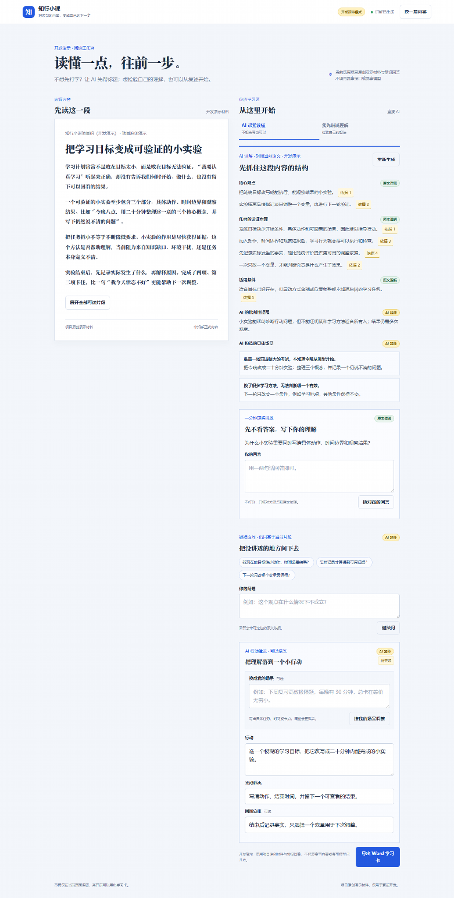
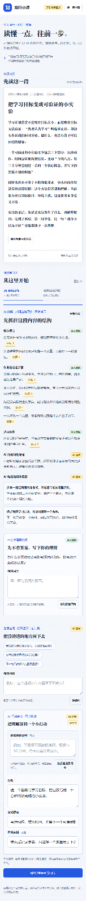

# 知行小课

将一条知乎建议转成可核对来源的讲解、一分钟理解挑战、按场景调整的小行动，以及可导出的 Word 学习卡。

体验预览：[AiWorks 预览](https://8huddlmsvtu1.preview.aiworks.site/)；[知乎项目页](https://www.zhihu.com/project/detail/150604)。预览可能需要已登录的知乎会话；AiWorks 项目仍在审核中。

> **真实边界**：当前在线体验是开发演示模式，只使用两篇项目原创材料和确定性的预设回答。它不会调用赛事内容 API 或赛事模型，不能作为真实模型生成的证据。





## 它如何帮助阅读

知行小课提供两条同等有效的入口：

- **AI 帮我读懂**：选择内容后，直接查看带引用的讲解。
- **我先说说理解**：先写下自己的复述，再获得带引用的核对和可选修订。

两条路径都会把原文理解、AI 延伸和用户输入明确区分。关键陈述附有可定位到当前材料片段的引用；之后可完成一个能由材料核对的一分钟理解挑战，继续追问，并输入自己的场景来调整行动建议、完成标志和回顾安排。行动始终是可编辑的 **待尝试** 草稿，不表示用户已经学习或采取行动。最后可导出包含来源、引用、讲解、问答、场景和行动草稿的 Word 学习卡。

## 本地运行

本仓库采用紧凑的 Node.js 24 / 浏览器架构：后端使用 Node.js 内置 HTTP 与 `fetch`，前端使用原生 ES modules；没有前端构建步骤或第三方运行时依赖。

```powershell
npm.cmd run demo
npm.cmd test
```

运行演示后访问 <http://127.0.0.1:3001/>。

## 公开文档

- [产品需求文档](docs/产品需求文档.md)
- [界面设计](docs/界面设计.md)
- [桌面端 QA 截图](docs/qa-2026-09-13/qa-desktop-direct.png)
- [移动端 QA 截图](docs/qa-2026-09-13/qa-mobile-393.png)

## 真值边界

本作品不宣称能够搜索完整知乎或取得完整正文；讲解仅基于当前可读材料片段。生成的行动始终为“待尝试”。真实模型的端到端生成尚未验证；开发演示中的预设回答不能替代该验证。
